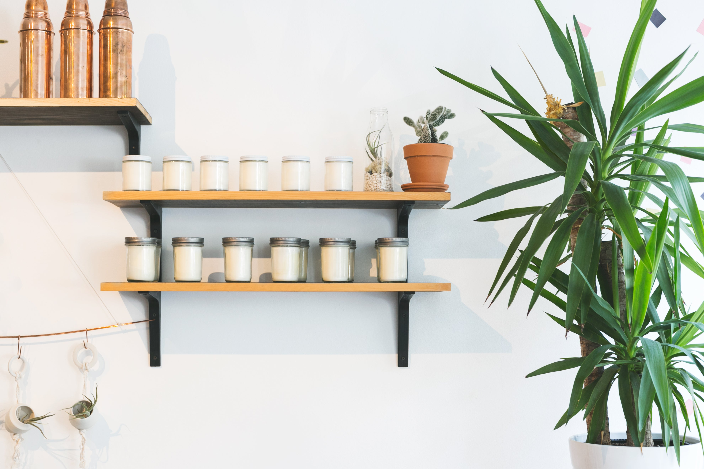

# Custom Shopify Theme


A modern, responsive, and customizable Shopify theme with both light and dark mode support. This theme is designed to provide an exceptional shopping experience with a focus on visual appeal and user experience.


## ✨ Features

- **Responsive Design**: Fully responsive layout that works on all devices
- **Dark Mode**: Elegant dark theme option for enhanced visual experience
- **Modular Sections**: Easily customizable sections for homepage and other pages
- **Optimized for Conversion**: Strategic placement of CTAs and product displays
- **Performance Focused**: Lightweight and fast-loading theme
- **SEO Friendly**: Built with best practices for search engine optimization
- **Accessibility**: WCAG compliant design elements
- **Custom Page Templates**: Specialized templates for about, collection, and product pages

## 🚀 Quick Start

### Local Development

1. Clone this repository:
   ```bash
   git clone https://github.com/yuvrajhash/shopify-custom-theme.git
   cd shopify-custom-theme
   ```

2. Preview locally:
   ```bash
   http-server
   ```
   Then open `http://localhost:8080/preview.html` in your browser.

### Deploying to Shopify

1. Install Shopify CLI:
   ```bash
   npm install -g @shopify/cli @shopify/theme
   ```

2. Connect to your Shopify store:
   ```bash
   shopify login
   ```

3. Push the theme to your store:
   ```bash
   shopify theme push
   ```

## 🎨 Theme Structure

```
├── assets/             # Theme assets (CSS, JS, images)
├── config/             # Theme settings
├── layout/             # Theme layouts
├── sections/           # Theme sections
├── snippets/           # Reusable code snippets
├── templates/          # Page templates
├── preview.html        # Local preview file
└── preview.css         # Styles for preview
```

## 📋 Section Overview

| Section | Description |
|---------|-------------|
| Hero Banner | Full-width banner with customizable image and text |
| Featured Collection | Display featured products in a grid layout |
| Image with Text | Combine images with descriptive text |
| Newsletter | Email signup with background image |
| Header | Navigation and logo display |
| Footer | Site links and information |

## 🌙 Dark Mode

This theme includes a sophisticated dark mode with:

- Dark background with light text for better contrast
- Blue accent colors for interactive elements
- Enhanced card styling with subtle shadows
- Image overlays for improved text readability
- Inverted logo colors for dark backgrounds

## 📱 Responsive Breakpoints

- **Mobile**: Up to 480px
- **Tablet**: 481px to 768px
- **Desktop**: 769px and above

## 🛠️ Customization

The theme can be customized through:

1. **Shopify Theme Editor**: Once uploaded to Shopify, use the theme editor to modify sections
2. **Code Customization**: Edit the liquid, CSS, and JS files directly
3. **Settings Schema**: Adjust the `settings_schema.json` file to add custom settings

## 📝 License

This project is licensed under the MIT License - see the LICENSE file for details.

## 🤝 Contributing

Contributions, issues, and feature requests are welcome! Feel free to check the issues page.

## 📸 Screenshots

<details>
<summary>View Screenshots</summary>




</details>

## 📞 Contact

If you have any questions or feedback, please reach out:

- GitHub: [@Yuvrajhash](https://github.com/yuvrajhash)
- Email: choudharyt2022@gmail.com

---

Made with ❤️ by Yuvraj
